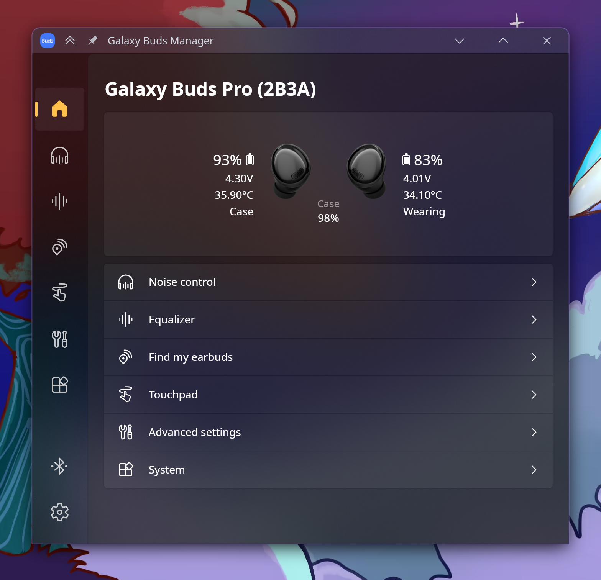

If you're rocking Samsung Galaxy Buds on desktop, you've probably realized the experience is a bit of a mixed bag. Sure, Samsung has an official app on the Windows Store, but it's notoriously hit-or-miss—often bloated, restricted to specific models, and a total no-go if you're on Linux. 

Most of the time, we're just expected to be happy with a stable A2DP connection. But missing out on EQ profiles, ANC toggles, and firmware updates feels like you're only getting half the hardware you paid for.

But here’s the cool part: if there's a binary stream, there's a way to reverse-engineer it. Enter **GalaxyBudsClient**.



## The Technical Sauce

This isn't just some flimsy wrapper. The project ([GalaxyBudsClient](https://github.com/timschneeb/GalaxyBudsClient)) is a masterclass in protocol reverse-engineering. 

The Buds communicate over the **Serial Port Profile (SPP)**. Since Samsung doesn't publish the protocol docs, the devs had to sniff Bluetooth traffic to map out the binary opcodes. Under the hood, it's built with **.NET and Avalonia**, giving us a solid cross-platform UI that actually looks and feels native.

It essentially implements its own protocol handler to send raw hex commands to the buds to toggle things like Ambient Sound or Gaming Mode. It’s high-signal tooling that solves a real-world annoyance.

---

## What You Actually Get

Forget the "official" experience; this client often exposes *more* than the Samsung app:

*   **Granular Battery Stats:** Individual percentages for L/R buds and the case (on supported models).
*   **Touch Control Mapping:** Complete control over what a long-press actually does.
*   **Diagnostics & Self-Tests:** Run proximity sensor or touchpad tests directly from your desktop.
*   **Firmware Management:** Fetch and flash firmware directly. There's even a companion [firmware archive](https://github.com/timschneeb/galaxy-buds-firmware-archive) if you need to downgrade.

---

## Installation Guide

Getting it running is pretty straightforward regardless of your setup.

### Linux

**Flatpak (Universal):**
```bash
flatpak install me.timschneeberger.GalaxyBudsClient
```

**Arch Linux (AUR):**
```bash
yay -S galaxybudsclient-bin
```

### Windows

**Winget:**
```bash
winget install timschneeb.GalaxyBudsClient
```

---

## Why Not Just Use the Official Windows App?

Even if you’re on Windows, there are plenty of reasons to ditch the official Samsung Store app for this:

1.  **Resource Efficiency:** The official app can be surprisingly heavy for what it does. This client, built on Avalonia, is snappy and light on the RAM.
2.  **Customization:** The official app limits what you can do with touch controls. This client opens the floodgates, letting you map actions that Samsung didn't think you "needed."
3.  **Stability:** If you've ever dealt with the Samsung Store app failing to update or refusing to "see" your buds despite them being connected, you'll appreciate the directness of this client.

## Privacy & The "De-bloat" Factor

One of the biggest wins here is the lack of strings attached. 

*   **No Samsung Account Required:** The official mobile apps love to nag you for a login. This client? It just talks to your hardware. No cloud, no telemetry, no tracking.
*   **Offline First:** It doesn't need to "call home" to change your EQ settings. It sends the command over Bluetooth, and you're done. 
*   **Pure Tooling:** There’s no "store" tab, no promotions for the latest Galaxy phone, and no background services eating CPU cycles just to check for "updates" to a store you don't use.

It’s refreshing to have a tool that treats your hardware as *yours*, not as a gateway to an ecosystem.

---

## Final Thoughts

This project is a perfect example of why open source is vital for hardware. When a vendor decides a platform isn't worth their time, the community steps in and often builds something better. 

If you use Galaxy Buds and haven't tried this yet, you're missing out on half the hardware you paid for.

### Links
*   [Main Repository](https://github.com/timschneeb/GalaxyBudsClient)
*   [Firmware Archive](https://github.com/timschneeb/galaxy-buds-firmware-archive)
